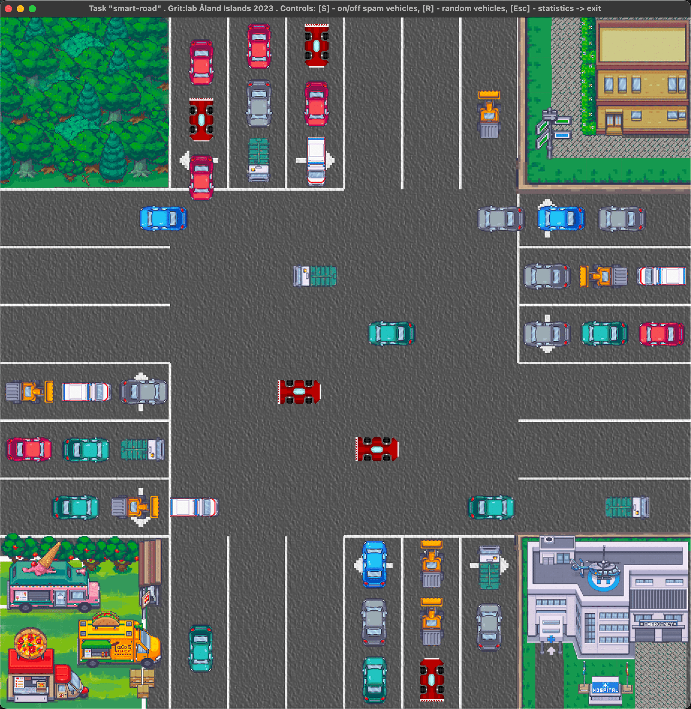

# task-smart-road
grit:lab Åland Islands 2023

## repository description
- `zero` branch - main branch, where the final code will be merged
- `smart-road` - folder with the final solution, plan to be copied to gitea restricted repository
- `_temp` - folder for temporary files, notes, etc  

Read the `readme.md` file inside the `smart-road` folder to get info how to run the solution.



## task description  
https://github.com/01-edu/public/blob/245e7c32a1835ee171014fdb8ceaa281762420de/subjects/smart-road/README.md

## recommendations
- use `_temp/yournameyouprefer` folder to manage minor stuff and temporary files/notes etc
- use `yourname-something` your unique branches, for development
- make pullrequest to merge your unique branches into `dev` branch
- finally code from `dev` will be merged into `zero` branch

## shallow overview

```
               |   |   |   |   |   |   |
               |   |   |   |   |   |   |
               |   |   |   |   |   |   |
               |r  | s | l |   |   |   |
_______________| ← | ↓ | → |   |   |   |________________
                           |            ↑ r
_______________            |            ________________
                           |            ← s
_______________            |            ________________
                           |            ↓ l
___________________________|____________________________
           l ↑             |
_______________            |            ________________
           s →             |
_______________            |            ________________
           r ↓             |
_______________            |            ________________
               |   |   |   | ← | ↑ | → |
               |   |   |   | l | s | r |
               |   |   |   |   |   |   |
               |   |   |   |   |   |   |
               |   |   |   |   |   |   |
               |   |   |   |   |   |   |
```

According to scheme , from the task , the system of smart road have to control only x6 variants of vehicle moving in loop. And the process can be the next:
- while one variant opened for each vehicle ready to start moving cross the road, the system control the other vehicles
- - keep the locked vehicles on place(waiting of their turn)
- - allow the new vehicles move close to the cross road, then lock them for waiting
- the next variants for opened moving are available(only one variant of road moving is opened at a time, other must be locked for move):
- - straight moving NS + SN (both directons, from North to South and reversed direction in same time...on screen from up to down and reversed direction)
- - straight moving WE + EW (both directons, from West to East and reversed direction in same time...on screen from left to right and reversed direction)
- - left turning NE (from North to East... on screen from up to right)
- - left turning ES (from East to South... on screen from right to down)
- - left turning SW (from South to West... on screen from down to left)
- - left turning WN (from West to North... on screen from left to up)

Looks like it is better to follow the next steps:
- implement the displaying of the road, where vehicles will moving
- implement the moving of the vehicles on the road
- implement the control of the vehicles moving(idea described above)

To implement vehicles texture, it is better to use square texture, and rotate it on (+|-)90 degrees(or use the frame/texture for rotated vehicle, to prevent pixel bluring), if needed, to show the vehicle in right direction.  
Also the vehicle texture size must be not wider than the road width(better to make them the same width/height), and on the right/left side from the vehicle texture pixels must be transparent. This will allow to prevent weird results on screen , which we can see in example video from 01-edu, where on 0.12 sec one vehicle hit another vehicle, which is road accident(not desirable case for the ... smart ... road system).
